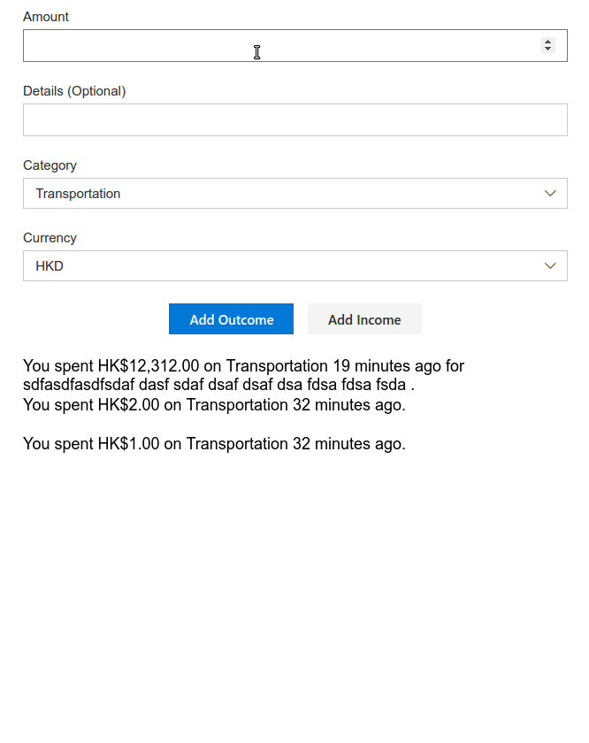

# Expense Tracker Lite

1. Add expense/income record
2. Categorise expenses/incomes
3. Multiple currencies supported
4. Offline first with [hoodiehq/hoodie](https://github.com/hoodiehq/hoodie)
5. Progressive web app (work offline)

## Screenshot

\* *typo: outcome => expense*
